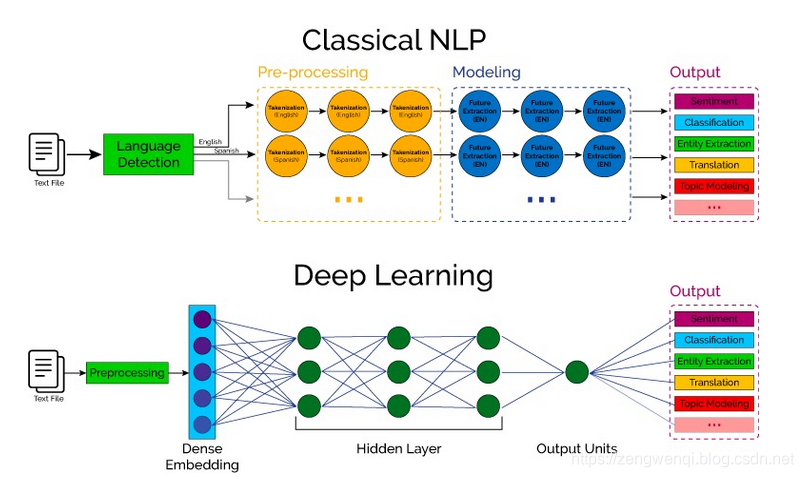

# nlp 入门

NLP的全称是Natuarl Language Processing，中文意思是自然语言处理，是人工智能领域的一个重要方向

自然语言处理（NLP）的一个最伟大的方面是跨越多个领域的计算研究，从人工智能到计算语言学的多个计算研究领域都在研究计算机与人类语言之间的相互作用。它主要关注计算机如何准确并快速地处理大量的 **自然语言语料库** 。自然语言语料是用现实世界语言表达的语言学习，是从文本和语言与另一种语言的关系中理解一组抽象规则的综合方法。

###### NLP的任务类型：

其中，类别”可以理解为是标签或者分类，而“序列”可以理解为是一段文本或者一个数组。NLP的任务就是从一种数据类型转换成另一种数据类型的过程，这与绝大多数的机器学习模型相同或者类似，所以掌握了NLP的技术栈就等于掌握了机器学习的技术栈。

###### 新旧NLP

## References

* https://blog.csdn.net/zwqjoy/article/details/103546648